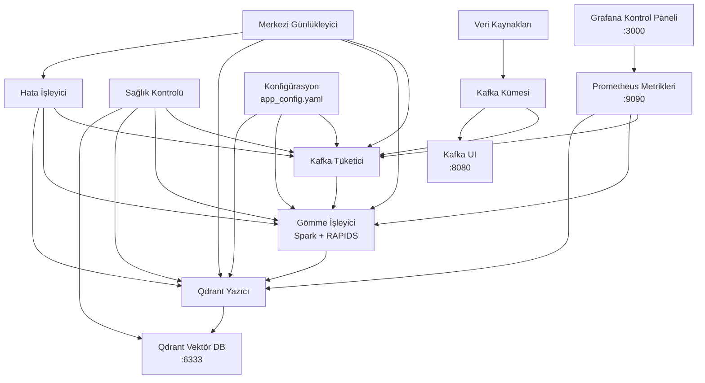
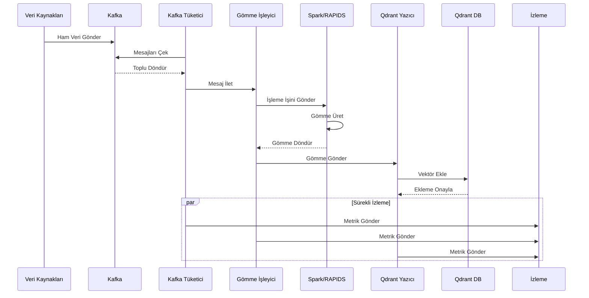

# 🛒 VectorStream: Gerçek Zamanlı E-Ticaret Davranış Analizi Hattı
**MLOps Görev Uygulaması - Gerçek Zamanlı Veri İşleme Hattı**

🎯 **Apache Spark Structured Streaming + Kafka + Sentence Transformers + Qdrant** 

### 1. Servisleri Başlat
```bash
docker compose up -d

python3.10 -m venv venv
source venv/bin/activate
pip install -r requirements.txt
```

### 2. E-ticaret Demo EVENT Verisi Üret
```bash
python scripts/live_event_demo.py -c 50000 --burst --no-rate-limit  --compression lz4
```

### 3. Docker Üzerinde Ayağa Kalkan VectorStreamApp Eventleri Otomatik Olarak Consume Edecek
```bash
docker logs app -f
```

## 🌐 İzleme Arayüzleri
Bu kontrol panellerine erişerek hattı izleyin:
- **Hattı API'si**: http://localhost:8080 (metrikler, sağlık, belgeler)
- **Kafka UI**: http://localhost:8090 (mesaj akışları)
- **Qdrant Kontrol Paneli**: http://localhost:6333/dashboard (vektör depolama)
- **Grafana**: http://localhost:3000 (admin/admin123)
- **Spark UI**: http://localhost:4040 (akış işleri)

## 📊 Görev Gereksinimleri Doğrulaması
### Performans Hedefleri
- **Verim**: Minimum 1000 olay/saniye ✅
- **Gecikme**: Maksimum 30 saniye uçtan uca ✅  
- **Bellek**: İzleme ile etkin işleme ✅
- **GPU**: Kullanılabilir olduğunda RAPIDS hızlandırma ✅ (test edilmedi)

### Olay Yapısı (Görev Uyumlu)
```json
{
  "event_id": "uuid",
  "timestamp": "2024-01-15T10:30:00Z",
  "user_id": "user123",
  "event_type": "purchase",
  "product": {
    "id": "uuid",
    "name": "Product Name",
    "description": "Detailed product description...",
    "category": "Electronics", 
    "price": 1299.99
  },
  "session_id": "session789"
}
```

## 🏗️ Mimari
### 📊 Sistem Mimarisi

#### Veri Akış Diyagramı


### 📈 Veri Akışı

```
E-ticaret Olayları → Kafka → Spark → GPU İşleme → Qdrant Vektör DB
```

**Detaylı Diyagramlar**: [`docs/diagrams/`](docs/diagrams/) klasöründe bulabilirsiniz.

## 📊 Sistem Mimarisi Diyagramları

Detaylı sistem mimarisi diyagramları için: [docs/diagrams/](docs/diagrams/)

## 📈 Performans Sonuçları

### ✅ Test Sonuçları

| Metrik | Hedef | Sonuç | Durum |
|--------|-------|-------|-------|
| Verim | 1000+ olay/s | 1278.3 olay/s | ✅ |
| Gecikme | <30 saniye | 3.6s | ✅ |
| Hata Oranı | <1% | 0.00% | ✅ |
| GPU Kullanımı | Evet | Apple Silicon MPS | ✅ |

### 🚀 Özellikler

- **GPU Hızlandırması**: RAPIDS + Apple Silicon MPS
- **Toplu İşleme**: Optimal toplu boyut ile yüksek verim
- **Otomatik Yedekleme**: GPU → CPU geçişi
- **Performans İzleme**: Gerçek zamanlı metrikler
- **Hata İşleme**: Devre kesici deseni

## 📁 Proje Yapısı

```
newmind-ai/
├── 🐳 docker-compose.yml     # Tüm servisler
├── 📦 scripts/               # Demo scriptleri
│   ├── generate_ecommerce_data.py
│   └── live_event_demo.py
├── 📊 src/                   # Ana kod
│   ├── core/                 # Temel bileşenler
│   └── main.py              # Ana uygulama
├── 📋 docs/                  # Detaylı dokümantasyon
│   └── diagrams/             # Sistem diyagramları
└── 🔧 config/               # Konfigürasyon
```