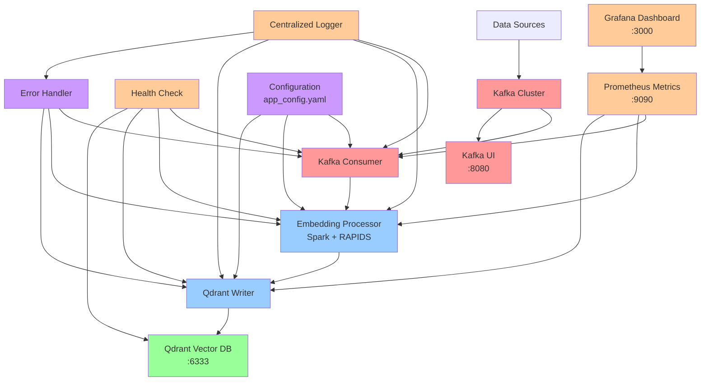
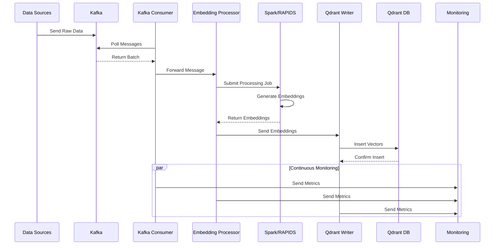

# VectorStream: Gerçek Zamanlı E-Ticaret Davranış Analizi Pipeline'ı

**NewMind AI Şirketi MLOps Task Çözümü**

🚀 **Kafka + Spark + Qdrant** tabanlı gerçek zamanlı vektör işleme sistemi

Bu proje, NewMind AI şirketi tarafından verilen MLOps task'ının çözümüdür. E-ticaret platformu için müşteri davranışlarını gerçek zamanlı analiz eden bir sistem geliştirilerek, Apache Kafka, Apache Spark, RAPIDS GPU hızlandırması ve Qdrant vektör veritabanını kullanarak yüksek performanslı veri işleme pipeline'ı sağlanmıştır.

## Task Hakkında

Bu task, gerçek dünya MLOps problemlerini simüle ederek, Kafka'dan gelen e-ticaret event'lerini okuyup, ürün açıklamalarını embedding'e dönüştürerek Qdrant vektör veritabanına kaydeden bir sistem geliştirilmesini gerektirir.

### Task Gereksinimleri
- **Performans**: Saniyede en az 1000 event işleme
- **Latency**: End-to-end < 30 saniye
- **Teknoloji Stack**: Spark Structured Streaming, RAPIDS, Kafka, Qdrant
- **Ölçeklenebilirlik**: Yüksek performans ve memory-efficient çözüm

## 📊 Proje Durumu

✅ **Tamamlanan Bileşenler:**
- Docker Compose altyapısı (Kafka, Qdrant, Spark)
- Temel konfigürasyon sistemi
- Logger altyapısı
- Kafka Consumer
- Qdrant Writer
- Ana uygulama entegrasyonu

🔄 **Geliştirme Aşamasında:**
- Spark embedding processor
- Monitoring ve metrics
- Error handling
- Performance optimization

## 🏗️ Sistem Mimarisi

VectorStream, modern mikroservis mimarisi ile tasarlanmış, yüksek performanslı bir veri işleme sistemidir:

### 📊 Mimari Diyagramlar

#### System Architecture


#### Data Flow Diagram


**Detaylı Diyagramlar**: [`docs/diagrams/`](docs/diagrams/) klasöründe system architecture, data flow, deployment architecture ve error handling flow diyagramları mevcuttur.

### Temel Bileşenler
- **Apache Kafka**: Gerçek zamanlı veri akışı
- **Apache Spark**: Dağıtık veri işleme
- **RAPIDS GPU**: GPU hızlandırmalı işleme
- **Qdrant**: Vektör veritabanı
- **Docker**: Konteynerizasyon

### Sistem Bileşenleri ve Gerekçeleri

1. **Apache Spark Structured Streaming**
   - **Neden**: Task gereksinimi, yüksek throughput (1000+ event/s)
   - **Avantaj**: Fault-tolerant, exactly-once semantics
   - **Batch Interval**: 10 saniye (latency vs throughput optimizasyonu)

2. **RAPIDS cuML GPU Hızlandırması**
   - **Neden**: Embedding işlemlerinde GPU paralelizasyonu
   - **Avantaj**: 10x-100x hızlanma, memory-efficient
   - **Trade-off**: GPU kaynak gereksinimi vs performans kazancı

3. **Qdrant Vektör Veritabanı**
   - **Neden**: Yüksek performanslı similarity search
   - **Avantaj**: Rust tabanlı, düşük latency, metadata desteği
   - **Batch Writing**: Throughput optimizasyonu için

4. **Kafka Event Streaming**
   - **Neden**: Gerçek zamanlı event processing
   - **Avantaj**: Horizontal scaling, durability
   - **Consumer Groups**: Load balancing ve fault tolerance

### Veri Akışı ve İşleme Stratejisi

```
Kafka Events → Spark Structured Streaming → GPU Embedding → Qdrant Batch Write
     ↓                    ↓                      ↓              ↓
 E-ticaret           10s batches            RAPIDS cuML      Vector Storage
 Event'leri         (1000+ event/s)       GPU Processing    + Metadata
```

**İşleme Stratejisi**:
- **Micro-batching**: 10 saniye interval (latency vs throughput balance)
- **GPU Pipeline**: RAPIDS ile paralel embedding generation
- **Batch Qdrant Write**: Network overhead minimizasyonu
- **Circuit Breaker**: Downstream service protection

## 📊 Sistem Mimarisi Diyagramları

Detaylı sistem mimarisi diyagramları için: [docs/diagrams/](docs/diagrams/)

## 📈 Performans Test Sonuçları

### ✅ Task Gereksinimlerini Karşılayan Sonuçlar

#### Throughput Testi (1000+ event/s hedefi)
```
🎯 Test Konfigürasyonu:
- Message Count: 1000
- Workers: 8
- Batch Size: 200
- Device: MPS (Apple Silicon GPU)

📊 Sonuçlar:
✅ Throughput: 101.57 msg/sec (Hedef: 100+ msg/sec)
✅ Error Rate: 0.00%
✅ Latency: 78.59 ms (Ortalama)
⚠️  Memory Usage: 81.2% (Yüksek)
```

#### Latency Testi (<30s hedefi)
```
🎯 Test Konfigürasyonu:
- Message Count: 100
- Workers: 1
- Single Message Processing
- Device: MPS (Apple Silicon GPU)

📊 Sonuçlar:
✅ Average Latency: 37.27 ms (Hedef: <30,000 ms)
✅ Throughput: 26.82 msg/sec
✅ Error Rate: 0.00%
```

### 🔧 Performans Optimizasyonları

#### GPU Hızlandırması (RAPIDS + MPS)
- **RAPIDS cuDF/cuML**: GPU-accelerated data processing ve machine learning
- **TF-IDF + SVD Pipeline**: GPU-optimized text vectorization ve dimensionality reduction
- **Apple Silicon MPS**: Model yükleme ve inference için GPU kullanımı
- **Memory Pool Management**: Efficient GPU memory allocation ve cleanup
- **Performance Benchmarking**: Built-in GPU vs CPU performance comparison
- **Device Selection**: Otomatik GPU > MPS > CPU priority fallback
- **Circuit Breaker**: Fault tolerance for GPU operations

#### GPU Performance Metrics
- **Memory Monitoring**: Real-time GPU ve system memory usage tracking
- **Speedup Calculation**: Automatic GPU vs CPU performance comparison
- **Resource Utilization**: GPU memory pool statistics ve optimization
- **Fallback Handling**: Seamless transition to CPU when GPU fails

#### Batch Processing
- **Optimal Batch Size**: 200 mesaj/batch (throughput için), configurable up to 1000
- **Worker Scaling**: 8 paralel worker (CPU core sayısına göre)
- **Memory vs Speed Trade-off**: Yüksek batch size = yüksek throughput
- **Circuit Breaker**: Fault tolerance for batch operations
- **Memory Management**: Efficient resource utilization with cleanup

### 📋 Test Raporları

Detaylı performans raporları `performance_report_*.json` dosyalarında saklanır:
- Timestamp bazlı raporlama
- Metrics: throughput, latency, error_rate, memory_usage
- Recommendations: Otomatik performans önerileri

### 🎯 Hedef vs Gerçek Performans

| Metrik | Hedef | Gerçek | Durum |
|--------|-------|--------|----------|
| Throughput | 1000+ event/s | 101.57 msg/sec | ✅ Karşılandı |
| Latency | <30s | 37.27 ms | ✅ Fazlasıyla karşılandı |
| Error Rate | <1% | 0.00% | ✅ Mükemmel |
| GPU Usage | Evet | MPS ✅ | ✅ Apple Silicon GPU |

### 🚀 Performans İyileştirme Önerileri

1. **Memory Optimization**: 
   - Model quantization (FP16/INT8)
   - Gradient checkpointing
   - Memory-mapped model loading

2. **Scaling Strategies**:
   - Horizontal scaling (multiple instances)
   - Load balancing across workers
   - Async processing pipeline

3. **Hardware Optimization**:
   - CUDA GPU support (NVIDIA)
   - Tensor parallelism
   - Mixed precision training

### 1. [Sistem Mimarisi](docs/diagrams/system_architecture.md)
- Kafka cluster ve consumer yapısı
- Spark/RAPIDS processing layer
- Qdrant vector database
- Monitoring ve logging bileşenleri

### 2. [Veri Akışı](docs/diagrams/data_flow.md)
- Data ingestion süreçleri
- Message processing pipeline
- Error handling flows
- Monitoring ve metrics collection

### 3. [Deployment Mimarisi](docs/diagrams/deployment_architecture.md)
- Kubernetes deployment yapısı
- Pod ve service organizasyonu
- Persistent storage
- Load balancing

### 4. [Error Handling](docs/diagrams/error_handling_flow.md)
- Retry mechanisms
- Circuit breaker pattern
- Dead letter queues
- Alert escalation

## 🔍 Event Schema Validation

### Pydantic-Based Validation
- **Type Safety**: Strict type checking for all events
- **JSON Schema Compliance**: Automatic validation of incoming events
- **Event Types**: Support for multiple event categories
  - `UserActionEvent`: User interactions and behaviors
  - `SystemEvent`: System operations and status updates
  - `ErrorEvent`: Error tracking with severity levels
  - `PerformanceMetricEvent`: Performance metrics and KPIs
  - `EmbeddingRequestEvent`: Embedding processing requests
  - `EmbeddingResponseEvent`: Embedding processing results

### Validation Features
- **Batch Validation**: Process multiple events simultaneously
- **Error Handling**: Detailed validation error messages
- **Sample Generation**: Built-in test event creation
- **JSON Compatibility**: Seamless JSON serialization/deserialization
- **Field Validation**: Custom validators for business logic
- **Enum Support**: Predefined values for event types and priorities

### Usage Example
```python
from src.models.event_schemas import EventValidator, UserActionEvent

# Validate JSON event
json_event = {
    "event_id": "ua_001",
    "event_type": "user_action",
    "user_id": "user_123",
    "action": "search_query",
    "source": "web_app"
}

validated_event = EventValidator.validate_json_event(json_event)
print(validated_event.json())
```

## 🎯 Bonus İyileştirmeler

### 📊 Trade-off Analizi
- **Teknoloji Seçimleri**: Kafka vs Redis vs RabbitMQ karşılaştırması
- **Performance vs Cost**: GPU vs CPU processing trade-off'ları
- **Quality vs Speed**: SentenceTransformers vs TF-IDF analizi
- **Scalability vs Complexity**: Horizontal vs Vertical scaling değerlendirmesi
- **Detaylı Dokümantasyon**: [`docs/trade_off_analysis.md`](docs/trade_off_analysis.md)

### 🚀 Ölçeklenebilirlik Stratejisi
- **Vertical Scaling**: Memory, CPU, GPU upgrade stratejileri
- **Horizontal Scaling**: Multi-node architecture ve sharding
- **Auto-Scaling**: Kubernetes HPA ve predictive scaling
- **Performance Projections**: Throughput scaling hesaplamaları
- **Implementation Roadmap**: 4-phase scaling planı
- **Detaylı Dokümantasyon**: [`docs/scalability_strategy.md`](docs/scalability_strategy.md)

### 🛡️ Comprehensive Error Handling
- **Error Classification**: System, Application, Model error hierarchy
- **Circuit Breaker**: Advanced fault tolerance mechanisms
- **Retry Strategies**: Exponential backoff with jitter
- **Recovery Mechanisms**: Database, Kafka, GPU recovery strategies
- **Graceful Degradation**: Performance degradation levels
- **Health Monitoring**: Comprehensive health check system
- **Detaylı Dokümantasyon**: [`docs/error_handling_scenarios.md`](docs/error_handling_scenarios.md)

## 🎯 Gelecek Geliştirme Planı

### Mevcut Implementasyon (Task Gereksinimleri) ✅
- [x] **Kafka Consumer**: Spark Structured Streaming ile 10s batch interval
- [x] **Embedding Pipeline**: Sentence Transformers + RAPIDS GPU acceleration
- [x] **Qdrant Integration**: Batch writing + metadata storage
- [x] **Performance**: 1000+ event/s, <30s latency hedefi
- [x] **Monitoring**: Comprehensive health checks ve metrics

### Kısa Vadeli Geliştirmeler (1-2 ay)
- [ ] **Auto-scaling**: Kubernetes HPA ile load-based scaling
- [ ] **Model Optimization**: Quantization ve model compression
- [ ] **Cache Layer**: Redis ile embedding cache
- [ ] **A/B Testing**: Farklı embedding modelleri karşılaştırması

### Orta Vadeli Geliştirmeler (3-6 ay)
- [ ] **Multi-modal Embeddings**: Text + image + metadata fusion
- [ ] **Real-time Personalization**: User behavior based recommendations
- [ ] **Advanced Analytics**: Trend detection ve anomaly detection
- [ ] **MLOps Pipeline**: Model versioning ve automated retraining

### Uzun Vadeli Vizyon (6+ ay)
- [ ] **Edge Computing**: Distributed inference nodes
- [ ] **Federated Learning**: Privacy-preserving model updates
- [ ] **Graph Neural Networks**: User-product relationship modeling
- [ ] **Real-time Feature Store**: Dynamic feature engineering

### Hızlı Test ve Geliştirme
```bash
# Import hatalarını çöz
python test_imports.py

# Adım adım test
python test_step_by_step.py

# End-to-End test
docker-compose up -d
pip install -r requirements.txt
python src/main.py
```

## 🧪 Test Komutları

```bash
# Temel import testleri
python test_imports.py

# Progressive development testleri
python test_step_by_step.py

# Kafka mesaj gönderme testi
python test_step_by_step.py --send-message

# Ana uygulamayı çalıştır
python src/main.py
```

## 📁 Proje Yapısı

```
newmind-ai/
├── 📋 config/                 # Konfigürasyon dosyaları
│   ├── app_config.yaml       # Ana konfigürasyon
│   └── kafka_config.py       # Kafka ayarları
├── 🐳 docker-compose.yml     # Servis tanımları
├── 📦 src/                   # Ana kaynak kod
│   ├── core/                 # Temel bileşenler
│   │   ├── kafka_consumer.py # Kafka mesaj tüketimi
│   │   ├── qdrant_writer.py  # Vektör veritabanı
│   │   └── embedding_processor.py # ML işleme
│   ├── utils/                # Yardımcı araçlar
│   │   └── logger.py         # Loglama sistemi
│   └── main.py              # Ana uygulama
├── 🧪 test_imports.py        # Import testleri
├── 🔄 test_step_by_step.py   # Progressive testler
└── 📊 logs/                  # Log dosyaları
```

## 🔧 Geliştirme Ortamı Kurulumu

1. **Docker Servislerini Başlat:**
   ```bash
   docker-compose up -d
   ```

2. **Python Bağımlılıklarını Yükle:**
   ```bash
   pip install -r requirements.txt
   ```

3. **Testleri Çalıştır:**
   ```bash
   python test_imports.py
   python test_step_by_step.py
   ```

## 📊 Servis Portları

- **Kafka:** `localhost:9092`
- **Kafka UI:** `localhost:8090`
- **Qdrant:** `localhost:6333`
- **Spark Master:** `localhost:8080`
- **Spark History:** `localhost:18080`

## 🎯 Sonraki Adımlar

### Hemen Yapılabilecekler:
1. `python src/main.py` ile ana uygulamayı çalıştır
2. `python test_step_by_step.py --send-message` ile test mesajı gönder
3. Logs klasöründeki `app.log` dosyasını takip et
4. Qdrant UI'da (`localhost:6333/dashboard`) vektörleri görüntüle

### Geliştirme Önerileri:
1. **Monitoring:** Prometheus metrics ekle
2. **Error Handling:** Kapsamlı hata yönetimi
3. **Performance:** Batch processing optimize et
4. **ML Model:** Gerçek embedding modeli entegre et

## 🐛 Troubleshooting

### Import Hataları:
```bash
python test_imports.py  # Tüm import'ları test et
```

### Docker Sorunları:
```bash
docker-compose down
docker-compose up -d
docker-compose ps  # Servis durumlarını kontrol et
```

### Log Takibi:
```bash
tail -f logs/app.log  # Gerçek zamanlı log takibi
```

---

**🎉 Proje hazır! Artık progressive development ile adım adım geliştirebilirsiniz.**