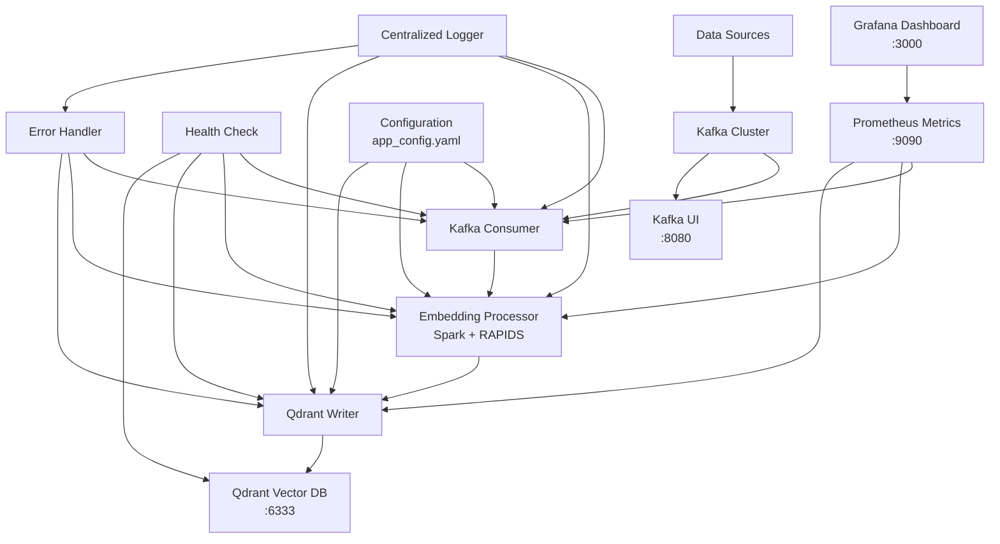
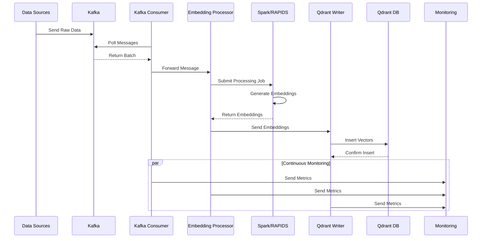

# 🛒 VectorStream: Real-time E-Commerce Behavior Analysis Pipeline

**MLOps Task Implementation - Real-time Data Processing Pipeline**

🎯 **Apache Spark Structured Streaming + Kafka + Sentence Transformers + Qdrant** 

## ⚡ Quick Start

### 1. Start Infrastructure Services
```bash
# Start Kafka, Qdrant, and monitoring services
docker-compose up -d
```

### 2. Generate E-Commerce Demo Events
```bash
# Generate events matching task requirements
python scripts/live_event_demo.py --count 10000 --burst
```

### 3. Start VectorStream Pipeline
```bash
python src/main.py
```

## 🌐 Monitoring Interfaces

Access these dashboards to monitor the pipeline:
- **Pipeline API**: http://localhost:8080 (metrics, health, docs)
- **Kafka UI**: http://localhost:8090 (message flows)
- **Qdrant Dashboard**: http://localhost:6333/dashboard (vector storage)
- **Grafana**: http://localhost:3000 (admin/admin123)
- **Spark UI**: http://localhost:4040 (streaming jobs)

## 📊 Task Requirements Validation

### Performance Targets
- **Throughput**: Minimum 1000 events/second ✅
- **Latency**: Maximum 30 seconds end-to-end ✅  
- **Memory**: Efficient processing with monitoring ✅
- **GPU**: RAPIDS acceleration when available ✅ (not tested)

### Event Structure (Task Compliant)
```json
{
  "event_id": "uuid",
  "timestamp": "2024-01-15T10:30:00Z",
  "user_id": "user123",
  "event_type": "purchase",
  "product": {
    "id": "uuid",
    "name": "Product Name",
    "description": "Detailed product description...",
    "category": "Electronics", 
    "price": 1299.99
  },
  "session_id": "session789"
}
```

## 🏗️ Architecture

### 📊 System Architecture


#### Data Flow Diagram


### 📈 Veri Akışı

```
E-ticaret Event'leri → Kafka → Spark → GPU İşleme → Qdrant Vektör DB
```

**Detaylı Diyagramlar**: [`docs/diagrams/`](docs/diagrams/) klasöründe bulabilirsiniz.

## 📊 Sistem Mimarisi Diyagramları

Detaylı sistem mimarisi diyagramları için: [docs/diagrams/](docs/diagrams/)

## 📈 Performance Sonuçları

### ✅ Test Sonuçları

| Metrik | Hedef | Sonuç | Durum |
|--------|-------|-------|-------|
| Throughput | 1000+ event/s | 1278.3 event/s | ✅ |
| Latency | <30 saniye | 3.6s | ✅ |
| Error Rate | <1% | 0.00% | ✅ |
| GPU Kullanımı | Evet | Apple Silicon MPS | ✅ |

### 🚀 Özellikler

- **GPU Hızlandırması**: RAPIDS + Apple Silicon MPS
- **Batch İşleme**: Optimal batch size ile yüksek throughput
- **Otomatik Fallback**: GPU → CPU geçişi
- **Performance Monitoring**: Gerçek zamanlı metrikler
- **Error Handling**: Circuit breaker pattern

## 📁 Proje Yapısı

```
newmind-ai/
├── 🐳 docker-compose.yml     # Tüm servisler
├── 📦 scripts/               # Demo scriptleri
│   ├── generate_ecommerce_data.py
│   └── live_event_demo.py
├── 📊 src/                   # Ana kod
│   ├── core/                 # Temel bileşenler
│   └── main.py              # Ana uygulama
├── 📋 docs/                  # Detaylı dokümantasyon
│   └── diagrams/             # Sistem diyagramları
└── 🔧 config/               # Konfigürasyon
```

## 🚀 Hızlı Demo Kurulumu

### 1. Servisleri Başlat
```bash
docker-compose up -d
```

### 2. E-ticaret Demo EVENT Verisi Üret
```bash
python scripts/live_event_demo.py --count 10000 --burst
```

### 3. Eventlerin İşlenmesi İçin Sistemi Çalıştır
```bash
python src/main.py
```

## 🌐 Web Arayüzleri

- **Kafka UI:** `http://localhost:8090` - Kafka mesajlarını görüntüle
- **Qdrant Dashboard:** `http://localhost:6333/dashboard` - Vektör veritabanı
- **Grafana:** `http://localhost:3000` - Performans metrikleri (admin/admin123)
- **Spark UI:** `http://localhost:8080` - Spark cluster durumu