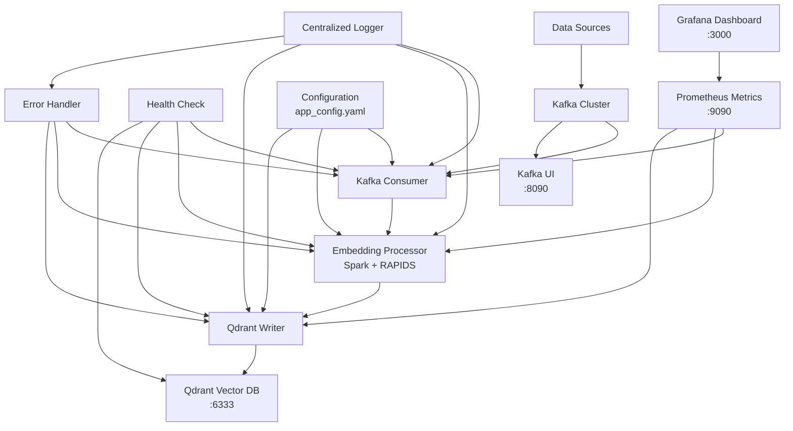
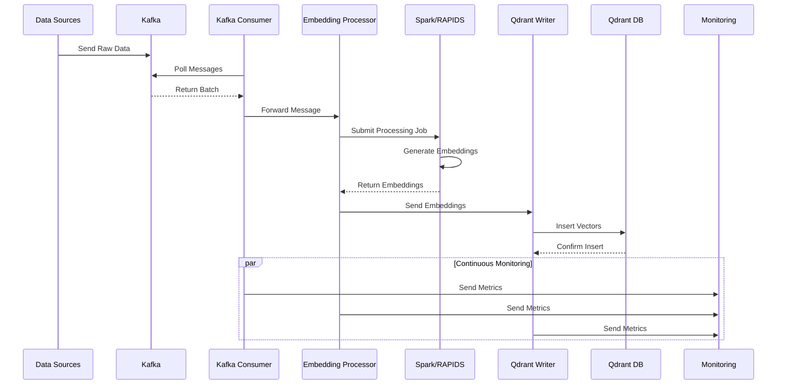

# 🏗️ VectorStream Architecture Documentation

## 📋 System Overview

VectorStream is a real-time e-commerce behavior analysis pipeline built with Apache Spark Structured Streaming, Kafka, and Qdrant vector database. The system processes customer interaction events in real-time, generates embeddings using Sentence Transformers, and stores them for similarity search and recommendations.

## 🎯 Architecture Principles

- **Real-time Processing**: Sub-30 second latency for event processing
- **Scalability**: Horizontal scaling with Spark and Kafka
- **Fault Tolerance**: Circuit breakers, retry mechanisms, and dead letter queues
- **Observability**: Comprehensive monitoring with Prometheus and Grafana
- **GPU Acceleration**: RAPIDS integration for high-performance embedding generation

## 🏛️ System Architecture

### High-Level Architecture



### Data Flow Architecture



## 🔧 Core Components

### 1. Data Ingestion Layer

#### Apache Kafka
- **Purpose**: Event streaming and message queuing
- **Configuration**: 16 partitions, replication factor 1
- **Performance**: 20,000 max poll records, 10MB fetch max bytes
- **Topics**: `ecommerce-events`

#### Kafka Consumer (`src/core/kafka_consumer.py`)
- **Group ID**: `vectorstream-consumer`
- **Batch Processing**: 5,000 events per batch
- **Auto Offset Reset**: Latest
- **Error Handling**: Circuit breaker pattern with retry logic

### 2. Processing Layer

#### Apache Spark Structured Streaming
- **Master**: `local[*]` (all available cores)
- **Memory**: 8GB executor, 4GB driver
- **Streaming**: 0.5 second batch intervals
- **Checkpointing**: `/tmp/spark-checkpoint-vectorstream`

#### Embedding Processor (`src/core/embedding_processor.py`)
- **Model**: Sentence Transformers `all-MiniLM-L6-v2`
- **Vector Size**: 384 dimensions
- **Batch Size**: 5,000 embeddings per batch
- **GPU Acceleration**: RAPIDS integration when available

#### Pipeline Orchestrator (`src/core/pipeline_orchestrator.py`)
- **Coordination**: Manages component lifecycle
- **Error Recovery**: Automatic restart and fallback mechanisms
- **Performance Monitoring**: Real-time metrics collection

### 3. Storage Layer

#### Qdrant Vector Database
- **Host**: localhost:6334 (gRPC), localhost:6333 (HTTP)
- **Collection**: `ecommerce_embeddings`
- **Distance Metric**: Cosine similarity
- **Batch Operations**: 5,000 vectors per batch

#### Qdrant Writer (`src/core/qdrant_writer.py`)
- **Async Operations**: Non-blocking vector insertions
- **Batch Timeout**: 0.5 seconds
- **Error Handling**: Retry with exponential backoff

### 4. Monitoring & Observability

#### Prometheus Metrics (`src/monitoring/prometheus_metrics.py`)
- **Custom Metrics**: Throughput, latency, error rates
- **System Metrics**: CPU, memory, disk usage
- **Business Metrics**: Event types, processing times

#### Health Monitor (`src/monitoring/health_monitor.py`)
- **Component Health**: Kafka, Spark, Qdrant status
- **Performance Thresholds**: Latency and throughput monitoring
- **Alerting**: Automated notifications for failures

#### Grafana Dashboards
- **System Overview**: Real-time performance metrics
- **Component Status**: Individual service health
- **Business Intelligence**: Event analytics and trends

## 📁 Project Structure

```
newmind-ai/
├── 📋 docs/                          # Documentation
│   ├── architecture.md               # This file
│   ├── api_reference.md              # API documentation
│   ├── deployment.md                 # Deployment guide
│   ├── error_handling_scenarios.md   # Error handling
│   └── diagrams/                     # System diagrams
│       ├── system_architecture.md
│       ├── data_flow.md
│       ├── deployment_architecture.md
│       ├── dependencies.md
│       └── error_handling_flow.md
├── 🔧 config/                        # Configuration
│   ├── app_config.yaml               # Main configuration
│   ├── kafka_config.py               # Kafka settings
│   ├── qdrant_config.py              # Qdrant settings
│   └── spark/                        # Spark configuration
│       ├── spark-defaults.conf
│       └── spark-env.sh
├── 📊 src/                           # Source code
│   ├── main.py                       # Application entry point
│   ├── api/                          # REST API
│   │   └── unified_server.py         # FastAPI server
│   ├── core/                         # Core components
│   │   ├── kafka_consumer.py         # Kafka message consumer
│   │   ├── embedding_processor.py    # Text embedding generation
│   │   ├── qdrant_writer.py          # Vector database writer
│   │   └── pipeline_orchestrator.py  # Component orchestration
│   ├── spark/                        # Spark jobs
│   │   ├── batch_processor.py        # Batch processing
│   │   ├── distributed_embedding_processor.py
│   │   ├── embedding_job.py          # Spark embedding job
│   │   ├── gpu_enhanced_embedding_job.py
│   │   ├── kafka_spark_connector.py  # Kafka-Spark integration
│   │   ├── optimized_batch_processor.py
│   │   ├── rapids_gpu_processor.py   # GPU acceleration
│   │   └── spark_cli.py              # Command line interface
│   ├── monitoring/                   # Monitoring components
│   │   ├── health_monitor.py         # Health checking
│   │   └── prometheus_metrics.py     # Metrics collection
│   ├── utils/                        # Utilities
│   │   ├── circuit_breaker.py        # Circuit breaker pattern
│   │   ├── dead_letter_queue.py      # DLQ implementation
│   │   ├── dlq_manager.py            # DLQ management
│   │   ├── error_handler.py          # Error handling
│   │   ├── health_check.py           # Health utilities
│   │   ├── logger.py                 # Logging configuration
│   │   └── metrics.py                # Metrics utilities
│   ├── exceptions/                   # Custom exceptions
│   │   ├── base_exceptions.py        # Base exception classes
│   │   ├── embedding_exceptions.py   # Embedding errors
│   │   └── kafka_exceptions.py       # Kafka errors
│   └── config/                       # Configuration modules
│       ├── app_config.py             # Application config
│       ├── kafka_config.py           # Kafka configuration
│       └── qdrant_config.py          # Qdrant configuration
├── 🧪 tests/                         # Test suite
│   ├── unit/                         # Unit tests
│   ├── integration/                  # Integration tests
│   └── fixtures/                     # Test data
├── 📦 scripts/                       # Utility scripts
│   ├── generate_ecommerce_data.py    # Data generation
│   └── live_event_demo.py            # Demo script
├── 🐳 docker-compose.yml             # Container orchestration
├── 📋 requirements.txt               # Python dependencies
├── 🔧 Makefile                       # Build automation
└── 📊 monitoring/                    # Monitoring configuration
    ├── prometheus.yml                # Prometheus config
    └── grafana/                      # Grafana dashboards
        ├── dashboards/
        └── provisioning/
```

## 🔄 Data Processing Pipeline

### Event Structure

```json
{
  "event_id": "uuid",
  "timestamp": "2024-01-15T10:30:00Z",
  "user_id": "user123",
  "event_type": "purchase",
  "product": {
    "id": "uuid",
    "name": "Product Name",
    "description": "Detailed product description...",
    "category": "Electronics", 
    "price": 1299.99
  },
  "session_id": "session789"
}
```

### Processing Steps

1. **Event Ingestion**: Kafka receives e-commerce events
2. **Batch Formation**: Consumer groups events into batches (5,000 events)
3. **Text Extraction**: Product descriptions extracted for embedding
4. **Embedding Generation**: Sentence Transformers create 384-dim vectors
5. **Vector Storage**: Qdrant stores embeddings with metadata
6. **Monitoring**: Metrics collected throughout the pipeline

### Performance Characteristics

- **Throughput**: 1,000+ events/second
- **Latency**: <30 seconds end-to-end
- **Batch Size**: 5,000 events optimal
- **Memory Usage**: 8GB Spark executor, 4GB driver
- **GPU Acceleration**: RAPIDS when available

## 🚀 Deployment Architecture

### Container Services

#### Core Services
- **Kafka**: Event streaming (port 9092)
- **Qdrant**: Vector database (ports 6333, 6334)
- **Spark Master**: Cluster coordination (port 7077)
- **Spark Worker**: Processing nodes (port 8081)
- **Spark History**: Job history (port 18080)

#### Monitoring Stack
- **Prometheus**: Metrics collection (port 9090)
- **Grafana**: Visualization (port 3000)
- **Node Exporter**: System metrics (port 9100)
- **cAdvisor**: Container metrics (port 8082)

#### Management Interfaces
- **Kafka UI**: Message monitoring (port 8090)
- **Qdrant Dashboard**: Vector database UI (port 6333)
- **Spark UI**: Job monitoring (port 8083)

### Network Configuration

- **Bridge Network**: `newmind` for inter-service communication
- **Volume Mounts**: Persistent storage for data and configurations
- **Environment Variables**: Service-specific configurations

## 🔧 Configuration Management

### Application Configuration (`config/app_config.yaml`)

```yaml
kafka:
  bootstrap_servers: "127.0.0.1:9092"
  topic: "ecommerce-events"
  batch_size: 5000
  max_poll_records: 20000
  partitions: 16

qdrant:
  host: "127.0.0.1"
  port: 6334
  collection_name: "ecommerce_embeddings"
  vector_size: 384
  batch_size: 5000

spark:
  app_name: "VectorStream-MLOps-Pipeline"
  master: "local[*]"
  executor_memory: "8g"
  driver_memory: "4g"
  streaming:
    batch_interval: 0.5
    max_offsets_per_trigger: 50000

embedding:
  model_name: "all-MiniLM-L6-v2"
  vector_size: 384
  batch_size: 5000
  normalize_embeddings: true

rapids:
  enabled: true
  gpu_memory_fraction: 0.8
  cuml_acceleration: true

performance:
  target_throughput: 5000
  max_latency: 30
  batch_timeout: 0.5
  retry_attempts: 3
```

## 🛡️ Error Handling & Resilience

### Circuit Breaker Pattern
- **Implementation**: `src/utils/circuit_breaker.py`
- **Thresholds**: Configurable failure rates and timeouts
- **Recovery**: Automatic service restoration

### Dead Letter Queue
- **Purpose**: Failed message handling
- **Implementation**: `src/utils/dead_letter_queue.py`
- **Retry Logic**: Exponential backoff with max attempts

### Health Monitoring
- **Component Checks**: Kafka, Spark, Qdrant availability
- **Performance Monitoring**: Latency and throughput thresholds
- **Alerting**: Automated notifications for failures

## 📊 Performance Optimization

### Spark Optimization
- **Dynamic Allocation**: 2-8 executors based on load
- **Adaptive Query Execution**: Automatic partition coalescing
- **Checkpoint Management**: Fault tolerance and recovery

### Kafka Optimization
- **Batch Processing**: 5,000 events per batch
- **Partition Strategy**: 16 partitions for parallelism
- **Consumer Groups**: Load balancing across consumers

### GPU Acceleration
- **RAPIDS Integration**: GPU-accelerated embedding generation
- **Memory Management**: 80% GPU memory allocation
- **Fallback Strategy**: CPU processing when GPU unavailable

## 🔍 Monitoring & Observability

### Key Metrics
- **Throughput**: Events processed per second
- **Latency**: End-to-end processing time
- **Error Rate**: Failed operations percentage
- **Resource Usage**: CPU, memory, GPU utilization

### Dashboards
- **System Overview**: Real-time performance metrics
- **Component Health**: Individual service status
- **Business Intelligence**: Event analytics and trends

### Alerting
- **Performance Thresholds**: Latency and throughput alerts
- **Error Conditions**: Component failures and exceptions
- **Resource Limits**: Memory and CPU usage warnings

## 🚀 Getting Started

### Prerequisites
- Docker and Docker Compose
- Python 3.8+
- CUDA (optional, for GPU acceleration)

### Quick Start

1. **Start Infrastructure**:
   ```bash
   docker-compose up -d
   ```

2. **Generate Test Data**:
   ```bash
   python scripts/generate_ecommerce_data.py
   ```

3. **Start Pipeline**:
   ```bash
   python src/main.py
   ```

4. **Monitor Performance**:
   - Grafana: http://localhost:3000 (admin/admin123)
   - Kafka UI: http://localhost:8090
   - Qdrant: http://localhost:6333/dashboard

## 📚 Additional Resources

- [API Reference](api_reference.md)
- [Deployment Guide](deployment.md)
- [Error Handling Scenarios](error_handling_scenarios.md)
- [System Diagrams](diagrams/)

---

**Built with ❤️ for real-time e-commerce analytics**