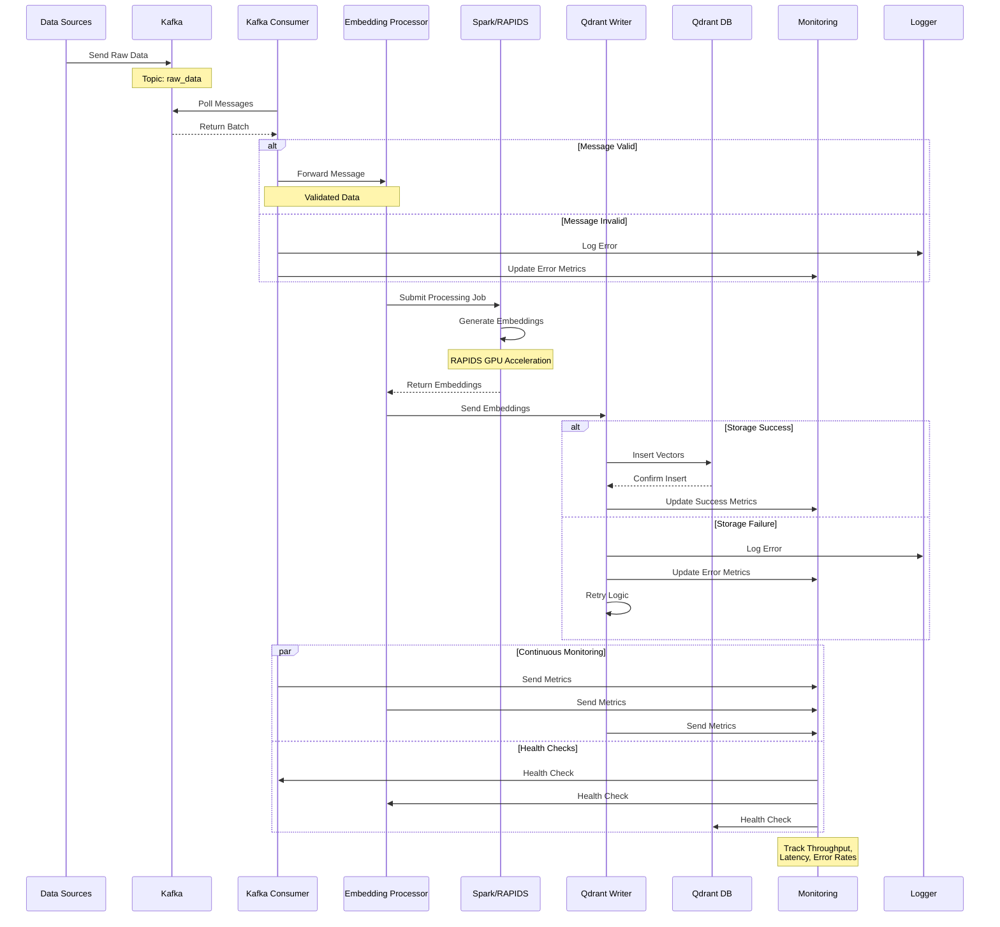

```mermaid
sequenceDiagram
    participant DS as Data Sources
    participant K as Kafka
    participant KC as Kafka Consumer
    participant EP as Embedding Processor
    participant S as Spark/RAPIDS
    participant QW as Qdrant Writer
    participant Q as Qdrant DB
    participant M as Monitoring
    participant L as Logger
    
    %% Data Ingestion Flow
    DS->>K: Send Raw Data
    Note over K: Topic: raw_data
    
    %% Consumption Flow
    KC->>K: Poll Messages
    K-->>KC: Return Batch
    
    %% Error Handling
    alt Message Valid
        KC->>EP: Forward Message
        Note over KC,EP: Validated Data
    else Message Invalid
        KC->>L: Log Error
        KC->>M: Update Error Metrics
    end
    
    %% Processing Flow
    EP->>S: Submit Processing Job
    S->>S: Generate Embeddings
    Note over S: RAPIDS GPU Acceleration
    S-->>EP: Return Embeddings
    
    %% Storage Flow
    EP->>QW: Send Embeddings
    
    alt Storage Success
        QW->>Q: Insert Vectors
        Q-->>QW: Confirm Insert
        QW->>M: Update Success Metrics
    else Storage Failure
        QW->>L: Log Error
        QW->>M: Update Error Metrics
        QW->>QW: Retry Logic
    end
    
    %% Monitoring Flow
    par Continuous Monitoring
        KC->>M: Send Metrics
        EP->>M: Send Metrics
        QW->>M: Send Metrics
    and Health Checks
        M->>KC: Health Check
        M->>EP: Health Check
        M->>Q: Health Check
    end
    
    %% Performance Tracking
    Note over M: Track Throughput,<br/>Latency, Error Rates
```