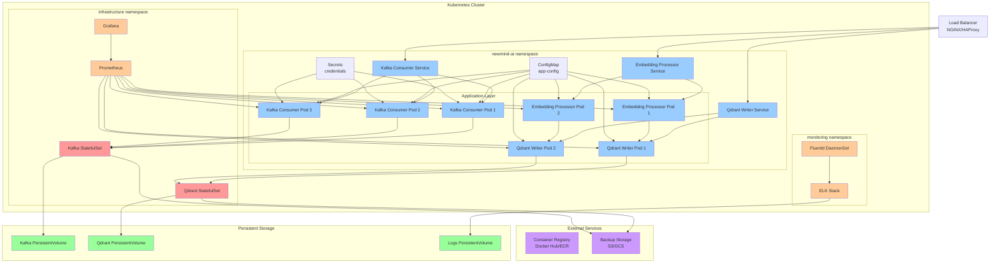

```mermaid
graph TB
    %% Load Balancer
    LB[Load Balancer<br/>NGINX/HAProxy]
    
    %% Kubernetes Cluster
    subgraph K8S["Kubernetes Cluster"]
        subgraph NS1["newmind-ai namespace"]
            %% Application Pods
            subgraph APP["Application Layer"]
                KC1[Kafka Consumer Pod 1]
                KC2[Kafka Consumer Pod 2]
                KC3[Kafka Consumer Pod 3]
                
                EP1[Embedding Processor Pod 1]
                EP2[Embedding Processor Pod 2]
                
                QW1[Qdrant Writer Pod 1]
                QW2[Qdrant Writer Pod 2]
            end
            
            %% Services
            SVC_KC[Kafka Consumer Service]
            SVC_EP[Embedding Processor Service]
            SVC_QW[Qdrant Writer Service]
            
            %% ConfigMaps and Secrets
            CM[ConfigMap<br/>app-config]
            SEC[Secrets<br/>credentials]
        end
        
        subgraph NS2["infrastructure namespace"]
            %% Infrastructure Components
            K[Kafka StatefulSet]
            Q[Qdrant StatefulSet]
            
            %% Monitoring Stack
            PROM[Prometheus]
            GRAF[Grafana]
        end
        
        subgraph NS3["monitoring namespace"]
            %% Logging Stack
            ELK[ELK Stack]
            FLUENTD[Fluentd DaemonSet]
        end
    end
    
    %% External Storage
    subgraph STORAGE["Persistent Storage"]
        PV1[Kafka PersistentVolume]
        PV2[Qdrant PersistentVolume]
        PV3[Logs PersistentVolume]
    end
    
    %% External Services
    subgraph EXT["External Services"]
        REGISTRY[Container Registry<br/>Docker Hub/ECR]
        BACKUP[Backup Storage<br/>S3/GCS]
    end
    
    %% Connections
    LB --> SVC_KC
    LB --> SVC_EP
    LB --> SVC_QW
    
    SVC_KC --> KC1
    SVC_KC --> KC2
    SVC_KC --> KC3
    
    SVC_EP --> EP1
    SVC_EP --> EP2
    
    SVC_QW --> QW1
    SVC_QW --> QW2
    
    KC1 --> K
    KC2 --> K
    KC3 --> K
    
    EP1 --> QW1
    EP2 --> QW2
    
    QW1 --> Q
    QW2 --> Q
    
    K --> PV1
    Q --> PV2
    ELK --> PV3
    
    CM --> KC1
    CM --> KC2
    CM --> KC3
    CM --> EP1
    CM --> EP2
    CM --> QW1
    CM --> QW2
    
    SEC --> KC1
    SEC --> KC2
    SEC --> KC3
    
    PROM --> KC1
    PROM --> KC2
    PROM --> KC3
    PROM --> EP1
    PROM --> EP2
    PROM --> QW1
    PROM --> QW2
    
    GRAF --> PROM
    
    FLUENTD --> ELK
    
    Q --> BACKUP
    K --> BACKUP
    
    %% Styling
    classDef app fill:#99ccff
    classDef infra fill:#ff9999
    classDef monitoring fill:#ffcc99
    classDef storage fill:#99ff99
    classDef external fill:#cc99ff
    
    class KC1,KC2,KC3,EP1,EP2,QW1,QW2,SVC_KC,SVC_EP,SVC_QW app
    class K,Q infra
    class PROM,GRAF,ELK,FLUENTD monitoring
    class PV1,PV2,PV3 storage
    class REGISTRY,BACKUP external
```