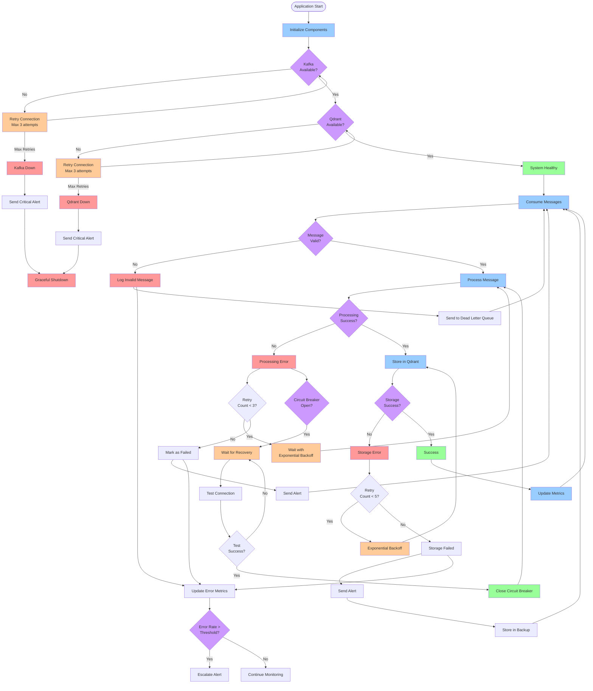

```mermaid
flowchart TD
    START([Application Start]) --> INIT[Initialize Components]
    
    INIT --> CHECK_KAFKA{Kafka<br/>Available?}
    CHECK_KAFKA -->|No| RETRY_KAFKA[Retry Connection<br/>Max 3 attempts]
    RETRY_KAFKA --> CHECK_KAFKA
    CHECK_KAFKA -->|Yes| CHECK_QDRANT{Qdrant<br/>Available?}
    
    CHECK_QDRANT -->|No| RETRY_QDRANT[Retry Connection<br/>Max 3 attempts]
    RETRY_QDRANT --> CHECK_QDRANT
    CHECK_QDRANT -->|Yes| HEALTHY[System Healthy]
    
    HEALTHY --> CONSUME[Consume Messages]
    
    %% Message Processing Flow
    CONSUME --> VALIDATE{Message<br/>Valid?}
    VALIDATE -->|No| LOG_INVALID[Log Invalid Message]
    LOG_INVALID --> DEAD_LETTER[Send to Dead Letter Queue]
    DEAD_LETTER --> CONSUME
    
    VALIDATE -->|Yes| PROCESS[Process Message]
    
    %% Processing Error Handling
    PROCESS --> PROC_SUCCESS{Processing<br/>Success?}
    PROC_SUCCESS -->|No| PROC_ERROR[Processing Error]
    PROC_ERROR --> CHECK_RETRY{Retry<br/>Count < 3?}
    CHECK_RETRY -->|Yes| WAIT[Wait with<br/>Exponential Backoff]
    WAIT --> PROCESS
    CHECK_RETRY -->|No| PROC_FAILED[Mark as Failed]
    PROC_FAILED --> ALERT_PROC[Send Alert]
    ALERT_PROC --> CONSUME
    
    PROC_SUCCESS -->|Yes| STORE[Store in Qdrant]
    
    %% Storage Error Handling
    STORE --> STORE_SUCCESS{Storage<br/>Success?}
    STORE_SUCCESS -->|No| STORE_ERROR[Storage Error]
    STORE_ERROR --> CHECK_STORE_RETRY{Retry<br/>Count < 5?}
    CHECK_STORE_RETRY -->|Yes| BACKOFF[Exponential Backoff]
    BACKOFF --> STORE
    CHECK_STORE_RETRY -->|No| STORE_FAILED[Storage Failed]
    STORE_FAILED --> ALERT_STORE[Send Alert]
    ALERT_STORE --> FALLBACK[Store in Backup]
    FALLBACK --> CONSUME
    
    STORE_SUCCESS -->|Yes| SUCCESS[Success]
    SUCCESS --> METRICS[Update Metrics]
    METRICS --> CONSUME
    
    %% Circuit Breaker Pattern
    PROC_ERROR --> CB_CHECK{Circuit Breaker<br/>Open?}
    CB_CHECK -->|Yes| CB_WAIT[Wait for Recovery]
    CB_WAIT --> CB_TEST[Test Connection]
    CB_TEST --> CB_SUCCESS{Test<br/>Success?}
    CB_SUCCESS -->|Yes| CB_CLOSE[Close Circuit Breaker]
    CB_CLOSE --> PROCESS
    CB_SUCCESS -->|No| CB_WAIT
    
    %% Health Check Failures
    RETRY_KAFKA -->|Max Retries| KAFKA_DOWN[Kafka Down]
    RETRY_QDRANT -->|Max Retries| QDRANT_DOWN[Qdrant Down]
    
    KAFKA_DOWN --> ALERT_KAFKA[Send Critical Alert]
    QDRANT_DOWN --> ALERT_QDRANT[Send Critical Alert]
    
    ALERT_KAFKA --> GRACEFUL_SHUTDOWN[Graceful Shutdown]
    ALERT_QDRANT --> GRACEFUL_SHUTDOWN
    
    %% Monitoring and Alerting
    LOG_INVALID --> MONITOR[Update Error Metrics]
    PROC_FAILED --> MONITOR
    STORE_FAILED --> MONITOR
    
    MONITOR --> THRESHOLD{Error Rate ><br/>Threshold?}
    THRESHOLD -->|Yes| ESCALATE[Escalate Alert]
    THRESHOLD -->|No| CONTINUE[Continue Monitoring]
    
    %% Styling
    classDef success fill:#99ff99
    classDef error fill:#ff9999
    classDef warning fill:#ffcc99
    classDef process fill:#99ccff
    classDef decision fill:#cc99ff
    
    class SUCCESS,HEALTHY,CB_CLOSE success
    class LOG_INVALID,PROC_ERROR,STORE_ERROR,KAFKA_DOWN,QDRANT_DOWN,GRACEFUL_SHUTDOWN error
    class RETRY_KAFKA,RETRY_QDRANT,WAIT,BACKOFF,CB_WAIT warning
    class INIT,CONSUME,PROCESS,STORE,METRICS process
    class CHECK_KAFKA,CHECK_QDRANT,VALIDATE,PROC_SUCCESS,STORE_SUCCESS,CB_CHECK,THRESHOLD decision
```