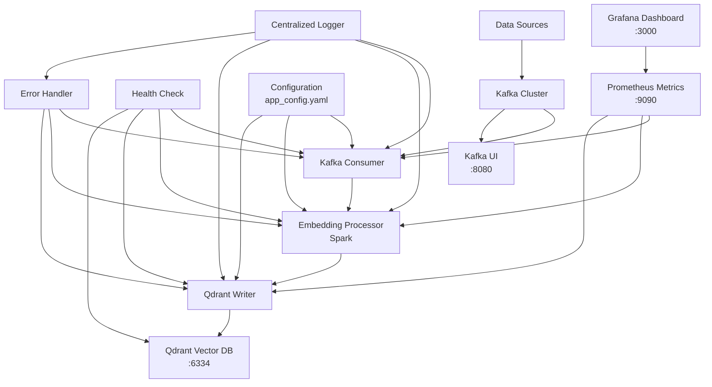

```mermaid
graph TB
    %% External Data Sources
    DS[Data Sources] --> K[Kafka Cluster]
    
    %% Kafka Layer
    K --> KC[Kafka Consumer]
    K --> KUI[Kafka UI<br/>:8080]
    
    %% Processing Layer
    KC --> EP[Embedding Processor<br/>Spark]
    EP --> QW[Qdrant Writer]
    
    %% Storage Layer
    QW --> Q[Qdrant Vector DB<br/>:6334]
    
    %% Monitoring & Health
    HC[Health Check] --> KC
    HC --> EP
    HC --> QW
    HC --> Q
    
    PM[Prometheus Metrics<br/>:9090] --> KC
    PM --> EP
    PM --> QW
    
    G[Grafana Dashboard<br/>:3000] --> PM
    
    %% Configuration
    CONFIG[Configuration<br/>app_config.yaml] --> KC
    CONFIG --> EP
    CONFIG --> QW
    
    %% Error Handling
    EH[Error Handler] --> KC
    EH --> EP
    EH --> QW
    
    %% Logging
    LOG[Centralized Logger] --> KC
    LOG --> EP
    LOG --> QW
    LOG --> EH
    
    
    class K,KC,KUI kafka
    class EP,QW processing
    class Q storage
    class HC,PM,G,LOG monitoring
    class CONFIG,EH config
```